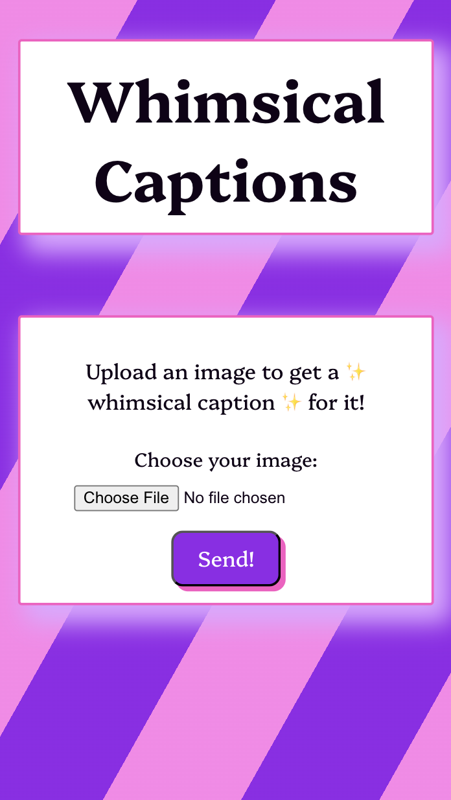
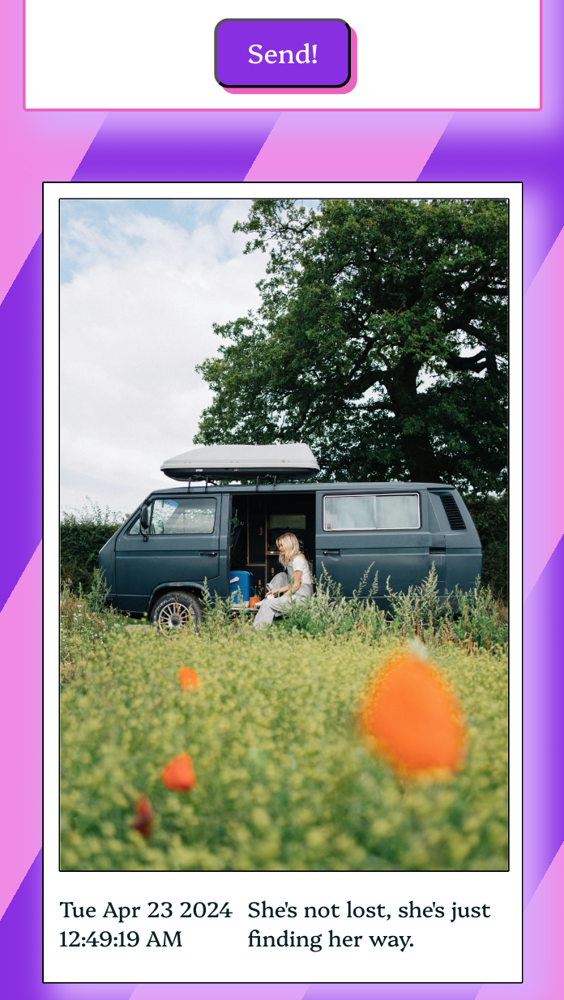
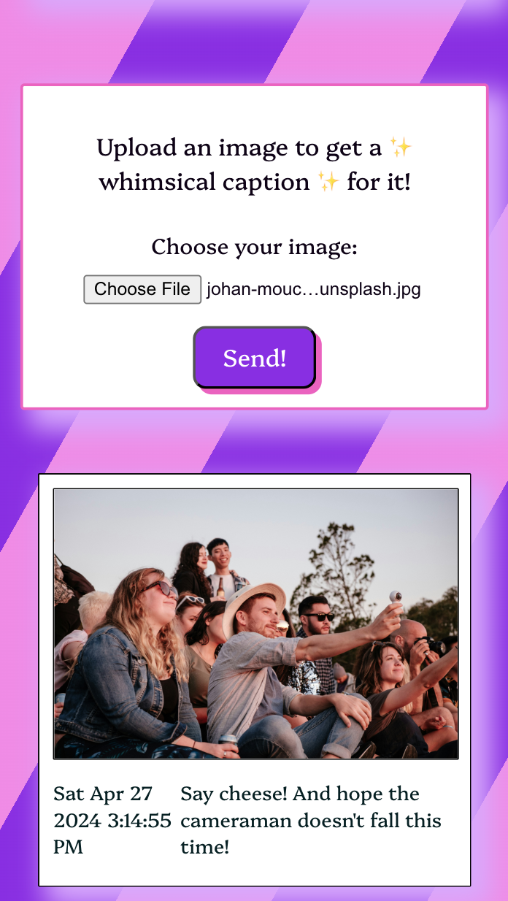
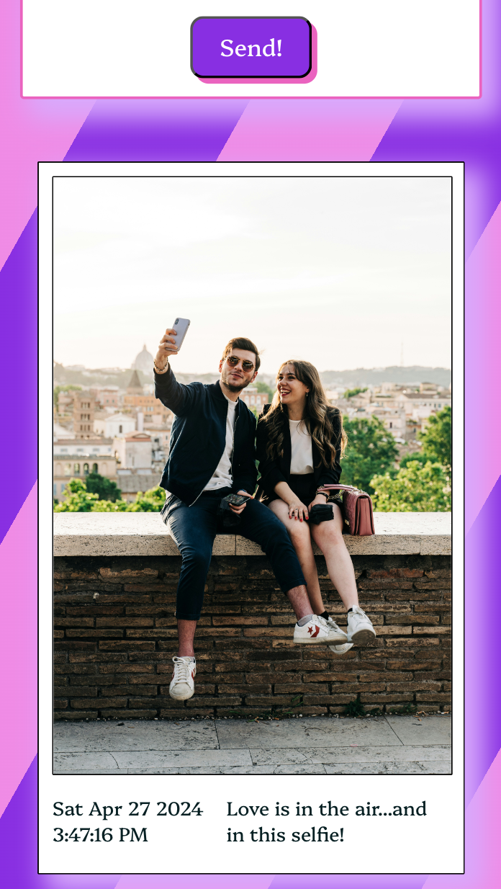

# ✨ Whimsical Captions ✨

An app that generates whimsical captions for your images. Built using Google's Gemini API.

## Showcase

### Landing Page

### Examples

## How to use the app

1. Go to the [Whimsical Captions](https://github.com/Sayed-Afnan-Khazi/whimsical-captions/) website.
2. Upload an image.
3. Click on the "Submit" button.
4. Enjoy your whimsical caption!

## Technologies Used

- HTML and CSS for the design.
- The frontend was built using ReactJS (create-react-app)
- The backend was built using NodeJS and ExpressJS.
- Google's Gemini API for caption generation using Gemini with vision.

## How to run the app locally

### Requirements

1. NodeJS
2. NPM

### Steps

1. Clone the repository.
2. Start the backend server:
    - Go to the `backend` directory, using `cd backend/`.
    - Run `npm install` to install the dependencies.
    - Run `npm start` to start the server.
3. Start the frontend server:
    - Go to the `frontend` directory, using `cd frontend/`.
    - Run `npm install` to install the dependencies.
    - Run `npm start` to start the server.
4. Go to `http://localhost:3000/` to view and use the app.
5. Have fun!

## Future Improvements

- Adding a download button to download the polaroid style image with the caption.

## 🚀 Happy Captioning! 🚀